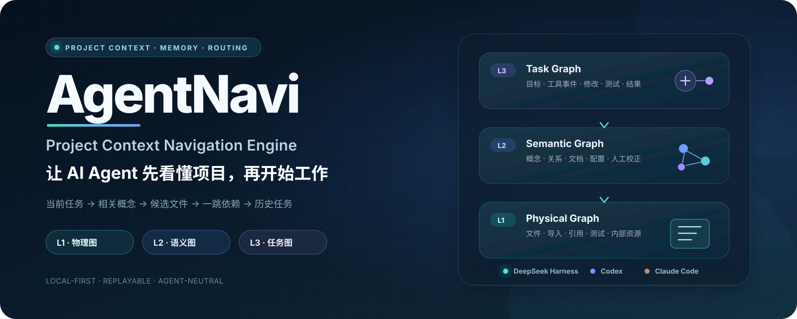

<p align="center">
  
</p>

<h1 align="center">AgentNavi</h1>

<p align="center">
  <strong>项目上下文导航引擎 · Project Context Navigation Engine</strong><br/>
  让 AI Agent 先看懂项目，再开始工作。
</p>

<p align="center">
  <a href="https://github.com/CoaseEdge/AgentNavi/actions/workflows/ci.yml"></a>
  <a href="https://github.com/CoaseEdge/AgentNavi/commits/main"></a>
  <a href="https://github.com/CoaseEdge/AgentNavi/graphs/commit-activity"></a>
  <a href="https://github.com/CoaseEdge/AgentNavi/issues"></a>
  <a href="https://github.com/CoaseEdge/AgentNavi/stargazers"></a>
  <a href="LICENSE"></a>
  <a href="https://github.com/CoaseEdge/AgentNavi"></a>
</p>

<!-- 仓库保持私有时，Shields 的 GitHub 统计徽章可能无法读取；仓库公开后会自动显示实时数据。 -->

<p align="center">
  <a href="pyproject.toml"></a>
  <a href="CHANGELOG.md"></a>
  
  <a href="integrations/deepseek-harness/README.md"></a>
  <a href="integrations/README.md"></a>
  <a href="integrations/README.md"></a>
  <a href="#一组必须说明边界的-token-数据"></a>
</p>

<p align="center">
  <a href="#一句话理解-agentnavi">项目定位</a> ·
  <a href="#三层项目地图">三层架构</a> ·
  <a href="#一组必须说明边界的-token-数据">基准数据</a> ·
  <a href="#已支持-deepseek-harness">DeepSeek Harness</a> ·
  <a href="#五分钟开始使用">快速开始</a> ·
  <a href="#文档">文档</a>
</p>

> 一个独立于项目仓库、具体 Agent 和 Obsidian 的项目上下文导航引擎。
>
> 它不替你写代码，而是让 Codex、Claude Code、DeepSeek Harness 等 Agent 在动手前先知道：**应该读什么、为什么相关、过去发生过什么。**

很多人以为，AI 写代码最昂贵的部分是“生成代码”。

但在真实项目里，大量时间和 Token 往往消耗在更前面：

```text
列目录
→ 搜关键词
→ 读几个文件
→ 发现新的依赖
→ 再搜索
→ 再读取
→ 找测试
→ 猜过去为什么这样设计
→ 才开始修改
```

换一个 Agent，开一个新会话，甚至只是隔天继续，往往又要重新走一遍。

问题不是模型不会写，而是它每次进入项目时都像第一次来。

AgentNavi 要解决的，就是这个“每次都从零找路”的问题。

---

## 一句话理解 AgentNavi

**它是一张给 AI Agent 使用的项目地图，也是一套可以跨会话积累的项目记忆。**

面对一个任务，AgentNavi 默认沿着这条路径缩小搜索范围：

```text
当前任务
  → 相关概念
  → 候选文件
  → 必要的一跳依赖
  → 相关历史任务
```

它的目标不是把整张知识图谱塞进上下文，而是在不漏掉必要文件的前提下，让 Agent 少走弯路。

---

## 它不是什么

AgentNavi **不是另一个自动编程 Agent**。

它不替代 Codex、Claude Code 或 DeepSeek Harness，也不控制模型怎样推理和怎样修改代码。

两者的分工更像这样：

```text
Codex / Claude Code / DeepSeek Harness
负责：读取、修改、执行、测试

AgentNavi
负责：导航、关联、记忆、历史和上下文路由
```

执行者可以更换，项目认知可以继续保留。

---

# 三层项目地图

AgentNavi 把项目组织成三层。

```text
L3 任务图：为什么做、读过什么、改过什么、测试与结果
        ↓
L2 语义图：项目里有哪些概念，它们怎样关联
        ↓
L1 物理图：文件、导入、引用、测试和内部资源怎样连接
        ↓
真实项目仓库：唯一运行事实来源
```

## L1：项目里客观存在什么

L1 尽量只记录可以从文件和结构中确定的事实，例如：

```text
upgrade.py imports payment.py
test_upgrade.py tests upgrade.py
pipeline.json references source.csv
query.sql reads customers
Forecast 工作表 formula_depends_on Inputs 工作表
```

除了文件，AgentNavi 还可以识别文件内部资源：

```text
model.xlsx#sheet:Forecast
analysis.ipynb#cell:12
science.sqlite#table:samples
data.csv#column:customer_id
main.go#symbol:function:main
```

当前已经覆盖多类代码、文档、配置、表格、数据库和科学数据格式。完整清单见 [文件提取器与格式支持](docs/file-formats.md)。

## L2：这些文件在业务上意味着什么

仅仅知道 `upgrade.py imports payment.py` 还不够。

人真正关心的是：

```text
“会员升级”由哪些文件实现？
“支付”有哪些测试？
哪个配置控制订阅？
哪份文档解释了这套设计？
```

因此，L2 会把分散的文件组织成概念：

```text
概念：会员升级
├── implemented_by → src/membership/upgrade.py
├── tested_by → tests/test_upgrade.py
├── documented_by → docs/membership.md
└── depends_on → 支付
```

L2 采用三层解释顺序：

```text
自动推断
  ↓
外部语义提供器
  ↓
人工 Overlay（最高优先级）
```

自动图谱可以随时重建；人的接受、拒绝、重命名、合并和文件映射会长期保存，不会被下一次扫描覆盖。

## L3：项目为什么变成今天这样

L3 记录一次任务实际发生了什么：

```text
任务：修改会员升级与支付逻辑
├── read → src/membership/upgrade.py
├── read → src/payment/service.py
├── modified → src/membership/upgrade.py
├── tested → tests/test_upgrade.py
├── affects → 会员升级
├── affects → 支付
└── result → 修改完成，测试通过
```

下一次再处理类似问题，Agent 不只是找到代码，还能看到过去的任务、修改路径和结果。

---

# 一组必须说明边界的 Token 数据

AgentNavi 不把“少读文件”自动等同于“节省 Token”。

只有必要文件没有漏掉、任务也成功，减少的 Token 才有意义。

仓库内置回归测试使用了这样一个案例：

> **任务：修改会员升级和支付逻辑，并运行对应测试。**

测试项目包含 5 个核心文件，并额外加入 24 份体积较大的无关文档，共 29 个文件。

在“真实 Agent 对照数据”测试夹具中：

| 对照方式 | 实际读取 | 必要文件召回率 | 任务状态 | 探索 Token |
|---|---:|---:|---|---:|
| 不使用 AgentNavi | 4 个文件，其中 1 个无关文件 | 100% | success | 10,000 |
| 使用 AgentNavi | 3 个文件，全部为必要文件 | 100% | success | 2,500 |

结果是：

```text
节省 Token：10,000 - 2,500 = 7,500
下降比例：7,500 / 10,000 = 75%
```

也就是说，在这个测试案例中，AgentNavi 将探索 Token 从 **10,000 降到 2,500**，减少了 **7,500 Token，降幅 75%**；同时没有牺牲必要文件召回率和任务成功状态。

同一个回归测试还验证了：在加入 24 份无关长文档后，AgentNavi 的必要文件召回率仍为 **100%**，相对全仓库扫描的估算上下文 Token 缩减必须高于 **50%**，否则测试不通过。

> **数据边界**
>
> 上述 10,000 和 2,500 是仓库回归测试中显式录入的对照数据，用来验证质量门槛、事件记录和 reduction 计算逻辑；它不是某一家模型供应商自动采集的生产账单，也不代表所有项目都固定节省 75%。
>
> 对真实项目，应使用同一模型、同一代码版本、同一任务和同一验收标准，分别记录 baseline 与 AgentNavi 的实际 Token、耗时和成功状态。

运行可重复检索基准：

```bash
agentnavi benchmark evaluate examples/benchmark-cases.json \
  --suite first-proof

agentnavi benchmark compare --suite first-proof
```

录入真实 Agent 对照：

```bash
agentnavi benchmark record <task_id> \
  --suite real-agent \
  --case membership-upgrade \
  --mode agentnavi \
  --expected src/membership/upgrade.py \
  --expected src/payment/service.py \
  --expected tests/test_upgrade.py \
  --exploration-tokens 2500 \
  --status success
```

正式 reduction 只有在以下条件成立时才会计入：

```text
baseline 必要文件召回率 ≥ 95%
AgentNavi 必要文件召回率 ≥ 95%
真实对照双方 success = true
```

详见 [基准测试](docs/benchmark.md)。

---

# 已支持 DeepSeek Harness

AgentNavi 现在可以作为 DeepSeek Harness 的本地项目认知插件使用。

完整链路是：

```text
Harness 用户任务
  → agent/pre-step 自动查询 AgentNavi
  → 注入紧凑项目上下文
  → Harness 正常调用工具完成任务
  → session/event 转换为 AgentNavi L3 事实
  → 下一次任务可以检索本次经验
```

第一阶段已经落地四项能力。

## 1. Local Provider

通过 DeepSeek Harness 的 `ctx.subprocess` 调用本机 `agentnavi` CLI：

- 参数以 argv 传递，不经过 shell 拼接；
- 支持工作目录、取消、超时和输出预算；
- 对外发布稳定的 `ctx.agentNavi` 服务；
- 后续可以替换为常驻进程、HTTP 或 MCP Provider。

## 2. 四个模型工具

```text
agentnavi_context  查询任务相关概念、文件与历史
agentnavi_impact   分析文件或概念的上下游影响
agentnavi_history  查询相关历史任务
agentnavi_scan     更新当前工作区索引
```

## 3. `agent/pre-step` 自动上下文注入

模型不需要先“想起来”调用 AgentNavi。

默认在每个用户任务的第一模型步骤前自动执行：

```text
真实用户消息
  → 建立 L3 任务
  → 增量扫描
  → 查询相关概念与文件
  → 作为 plugin snapshot 加入当前请求
```

查询失败时 fail-open，原有 Harness 任务继续执行。

## 4. L3 事件桥

DeepSeek Harness 的会话事件会转换为 AgentNavi 需要的长期事实：

```text
session/created              → 会话开始
真实用户 user/message        → 新任务
工具调用与结果               → 读取、修改、搜索、测试和命令
assistant/message            → 结果摘要候选
turn/end                     → 完成、失败、取消或中断
session/disposed             → 会话结束
```

Harness 继续保存完整模型与工具轨迹；AgentNavi 只保存未来导航需要的任务、文件、概念和结果，不复制思维流或整段完整对话。

## 安装到 DeepSeek Harness

先安装 AgentNavi：

```bash
git clone https://github.com/CoaseEdge/AgentNavi.git
cd AgentNavi
python -m pip install -e .
agentnavi init
```

再把插件组合包加入 Harness Profile：

```bash
dsh plugin --profile web add ./integrations/deepseek-harness
```

检查最终 Cordis 配置：

```bash
dsh --profile web --dump-config
```

当前 Local Provider 要求 Harness 与 AgentNavi 能访问同一个项目文件系统。完整配置、事件映射与安全边界见 [DeepSeek Harness 集成说明](integrations/deepseek-harness/README.md)。

---

# 接入 Codex 与 Claude Code

```bash
agentnavi integration install codex
agentnavi integration install claude
# 或者
agentnavi integration install all
```

安装器会保留已有 Hook，备份原配置，并安装“上下文优先”Skill。

Hook 工作流程：

```text
SessionStart
  → 注册项目、增量扫描、注入项目概览

UserPromptSubmit
  → 建立任务、写入 L3 日志、注入任务上下文

PostToolUse
  → 记录读取、修改、搜索、测试和命令

Stop
  → 增量扫描、关联受影响概念、保存结果、关闭任务

SessionEnd
  → 记录会话结束；未结束任务标记为 interrupted
```

所有 Hook 都采用 fail-open：AgentNavi 失败不会阻断主 Agent 工作。

---

# 五分钟开始使用
要求 Python 3.11 或更高版本。

```bash
git clone https://github.com/CoaseEdge/AgentNavi.git
cd AgentNavi
python -m pip install -e .
agentnavi init
```

也可以使用 `pipx` 隔离安装：

```bash
pipx install -e .
```

核心 Python 运行时只使用标准库。

进入一个需要管理的项目：

```bash
cd /path/to/your-project
agentnavi project add .
```

第一次会完成全量扫描，以后默认增量更新。

查询当前任务：

```bash
agentnavi context "修改会员升级与支付逻辑"
```

分析文件影响：

```bash
agentnavi impact src/membership/upgrade.py
```

查询历史任务：

```bash
agentnavi history "会员升级"
```

更新索引：

```bash
agentnavi scan
agentnavi scan --full
```

---

# 三条可靠性链路

## 1. L3 可以从独立日志重放

任务、工具事件、会话结束和结果会先追加写入：

```text
~/.agentnavi/events.jsonl
```

再写入 SQLite。即使数据库损坏，也可以恢复：

```bash
agentnavi event-log verify
agentnavi replay l3 --reset --strict
```

升级前已经存在于 SQLite 的任务历史，可以先补写：

```bash
agentnavi event-log backfill
```

详见 [L3 事件日志与重放](docs/l3-replay.md)。

## 2. 节省必须经过质量门槛

AgentNavi 同时保存：

- 候选文件数量；
- 必要文件召回率；
- 实际读取文件；
- 探索 Token；
- 完成耗时；
- success 状态。

只有“少读了文件”且“没有漏掉必要文件、任务也成功”，才会被统计为有效节省。

## 3. 人工判断不会被自动扫描冲掉

人工接受、拒绝、重命名、合并和文件映射保存在：

```text
~/.agentnavi/semantic-overlays.jsonl
```

常用命令：

```bash
agentnavi semantic review list
agentnavi semantic review accept <review_id>
agentnavi semantic review reject <review_id> --note "代码引用不代表稳定业务依赖"
```

人工 Overlay 在自动语义图之后应用，优先级最高。

详见 [语义审查与人工校正](docs/semantic-review.md)。

---

# Obsidian 只是视图，不是底层数据库

```bash
agentnavi export obsidian
```

导出到已有 Vault：

```bash
agentnavi export obsidian --destination ~/Documents/MyVault
```

AgentNavi 只管理目标 Vault 内的 `AgentNavi/` 子目录。

Obsidian 页面可以删除并重新生成，它不是运行依赖，也不是权威事实来源。

---

# 数据放在哪里

默认数据目录：

```text
~/.agentnavi/
├── config.json
├── agentnavi.db                 # 可重建的查询投影与缓存
├── events.jsonl                 # L3 权威事实日志
├── semantic-overlays.jsonl      # 人工语义校正权威日志
└── obsidian-vault/              # 可重建投影
```

被索引项目不会被写入：

```text
.agentnavi
_graph
.obsidian
```

真实项目仓库始终是运行事实来源。

---

# 当前能力

- Git 感知文件发现与增量扫描；
- 多语言代码、文档、配置、表格、数据库和科学数据文件提取；
- 文件导入、引用、测试、表关系和文件内部资源；
- 保守自动语义图与外部语义提供器；
- L3 append-only 事件日志、旧数据回填、校验和幂等重放；
- 可重复检索基准和真实 Agent 对照记录；
- L2 语义候选审查与持久化人工 Overlay；
- 上下文、影响和历史查询；
- DeepSeek Harness Local Provider、四个工具、自动上下文注入与 L3 事件桥；
- Codex / Claude Code Hook 与 Skill；
- Obsidian 单向投影。

---

# 当前边界

AgentNavi 当前仍处于 Alpha 阶段。

需要明确的边界包括：

- 多语言代码解析以保守导航为目标，不替代编译器、LSP 或 Tree-sitter；
- 检索基准中的估算 Token 来自文件体积，不等于供应商账单；
- 真实 Token、耗时和 success 仍需由 Agent 或运行时显式录入；
- 人工校正目前通过 CLI 审查，尚无图形化工作台；
- Obsidian 仍为单向投影，不直接回写生成页；
- DeepSeek Harness 当前只提供共享文件系统的 Local Provider；
- 远程沙箱仍需要未来的 HTTP/MCP Context Service；
- 尚未实现跨项目概念统一和组织级权限。

这些边界不是隐藏项，而是下一阶段开发路线的一部分。见 [开发路线](docs/roadmap.md)。

---

# 常用命令

```text
agentnavi init
agentnavi project add|list|remove
agentnavi scan
agentnavi query
agentnavi context
agentnavi impact
agentnavi history
agentnavi task start|event|close|list
agentnavi event-log verify|backfill
agentnavi replay l3
agentnavi benchmark evaluate|record|compare
agentnavi semantic review list|accept|reject
agentnavi semantic correction add|list|remove|apply
agentnavi semantic log verify|backfill|replay
agentnavi export obsidian
agentnavi integration show|install
agentnavi doctor
```

---

# 文档

- [架构说明](docs/architecture.md)
- [数据模型](docs/data-model.md)
- [文件格式支持](docs/file-formats.md)
- [Hook 工作流](docs/hooks.md)
- [DeepSeek Harness 集成](docs/deepseek-harness.md)
- [L3 事件日志与重放](docs/l3-replay.md)
- [基准测试](docs/benchmark.md)
- [语义审查与人工校正](docs/semantic-review.md)
- [外部语义提供器协议](docs/semantic-provider.md)
- [开发路线](docs/roadmap.md)
- [架构决策记录](docs/decisions/)

# 测试

Python 核心：

```bash
python -m compileall -q src
python -m unittest discover -s tests -v
```

DeepSeek Harness 集成：

```bash
cd integrations/deepseek-harness
npm run check
npm test
```

# 许可证

Apache-2.0
